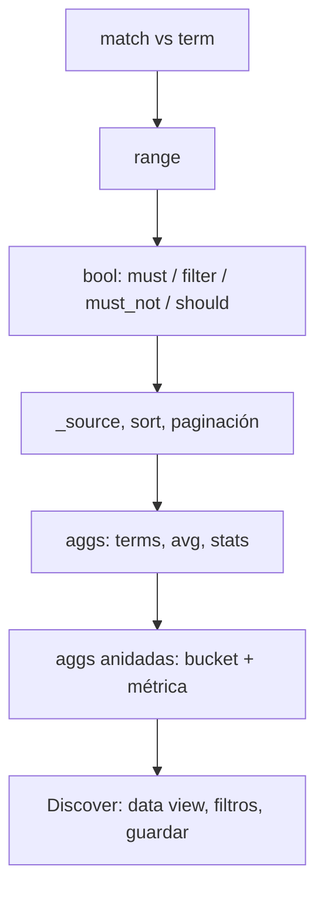

# Lab Día 3 — Explotación de datos: Query DSL, agregaciones y Discover

Laboratorio práctico sobre el índice `usuarios-ivan`. Hoy el foco es **explotar** los datos
(Query DSL, agregaciones y Discover), pero como el día 2 terminó borrando el índice, lo primero
es **volver a crearlo y cargar los datos** (apartado 0). Después ya solo consultamos.

> **Cómo ejecutarlo:** comandos en sintaxis **Dev Tools**
> (OpenSearch Dashboards → menú **☰ → Dev Tools → Console**).
> Pega cada bloque y pulsa ▶ (o `Ctrl/Cmd + Enter`) sobre la línea del comando.

> **Clúster compartido — usa TU nombre.** El clúster es común a toda la clase, así que cada
> alumno trabaja sobre su propio índice: `usuarios-<tunombre>` (p.ej. `usuarios-hector`).
> En este lab aparece `usuarios-ivan`: **sustitúyelo por el tuyo** en TODOS los comandos
> (en Dev Tools, `Ctrl/Cmd + H` reemplaza todo de golpe).

---

## 0. Punto de partida: recrear el índice y cargar datos

Partimos de **cero** (el día 2 lo borramos). Estos tres comandos dejan el índice listo.
Es exactamente lo del día 2 — aquí va condensado para no depender de aquel documento.

### 0.1 Crear el índice (mappings + analizador español)

```
PUT usuarios-ivan
{
  "settings": {
    "number_of_shards": 3,
    "number_of_replicas": 1,
    "analysis": {
      "analyzer": {
        "analizador_es": {
          "type": "custom",
          "tokenizer": "standard",
          "filter": ["lowercase", "asciifolding", "stop_es"]
        }
      },
      "filter": {
        "stop_es": { "type": "stop", "stopwords": "_spanish_" }
      }
    }
  },
  "mappings": {
    "properties": {
      "nombre":         { "type": "text", "analyzer": "analizador_es", "fields": { "raw": { "type": "keyword" } } },
      "email":          { "type": "keyword" },
      "edad":           { "type": "integer" },
      "ciudad":         { "type": "keyword" },
      "bio":            { "type": "text", "analyzer": "analizador_es" },
      "intereses":      { "type": "keyword" },
      "activo":         { "type": "boolean" },
      "fecha_registro": { "type": "date", "format": "yyyy-MM-dd" }
    }
  }
}
```

### 0.2 Cargar los 6 usuarios con `_bulk`

> ⚠️ La **última línea debe terminar con un salto de línea** (deja una línea en blanco al final).

```
POST _bulk
{ "index": { "_index": "usuarios-ivan", "_id": "1" } }
{ "nombre": "María García López", "email": "maria.garcia@example.com", "edad": 28, "ciudad": "Madrid", "bio": "Ingeniera de software apasionada por la inteligencia artificial", "intereses": ["IA", "running", "lectura"], "activo": true, "fecha_registro": "2024-01-15" }
{ "index": { "_index": "usuarios-ivan", "_id": "2" } }
{ "nombre": "Juan Martínez Ruiz", "email": "juan.martinez@example.com", "edad": 35, "ciudad": "Barcelona", "bio": "Arquitecto de datos especializado en sistemas distribuidos", "intereses": ["datos", "ciclismo", "fotografía"], "activo": true, "fecha_registro": "2023-06-22" }
{ "index": { "_index": "usuarios-ivan", "_id": "3" } }
{ "nombre": "Ana Fernández Soto", "email": "ana.fernandez@example.com", "edad": 42, "ciudad": "Valencia", "bio": "Científica de datos con experiencia en machine learning", "intereses": ["ML", "yoga", "viajes"], "activo": false, "fecha_registro": "2022-11-03" }
{ "index": { "_index": "usuarios-ivan", "_id": "4" } }
{ "nombre": "Carlos Sánchez Díaz", "email": "carlos.sanchez@example.com", "edad": 31, "ciudad": "Madrid", "bio": "Desarrollador backend experto en bases de datos y búsqueda", "intereses": ["backend", "gaming", "música"], "activo": true, "fecha_registro": "2024-03-10" }
{ "index": { "_index": "usuarios-ivan", "_id": "5" } }
{ "nombre": "Lucía Rodríguez Gil", "email": "lucia.rodriguez@example.com", "edad": 26, "ciudad": "Sevilla", "bio": "Analista de seguridad informática y entusiasta del open source", "intereses": ["seguridad", "linux", "escalada"], "activo": true, "fecha_registro": "2023-09-18" }
{ "index": { "_index": "usuarios-ivan", "_id": "6" } }
{ "nombre": "Pedro Gómez Moreno", "email": "pedro.gomez@example.com", "edad": 39, "ciudad": "Bilbao", "bio": "DevOps engineer trabajando con Kubernetes y observabilidad", "intereses": ["devops", "kubernetes", "senderismo"], "activo": false, "fecha_registro": "2022-05-30" }

```

### 0.3 Refrescar y comprobar

```
POST usuarios-ivan/_refresh
```

```
GET usuarios-ivan/_count
```
→ `"count": 6`

```
GET usuarios-ivan/_mapping
```

Recordatorio de tipos (de aquí depende qué query usar en cada campo):

| Campo | Tipo | Query adecuada |
|---|---|---|
| `nombre` | `text` (+ `nombre.raw` keyword) | `match` (texto) · `nombre.raw` para ordenar/agregar |
| `email` | `keyword` | `term` |
| `edad` | `integer` | `range` |
| `ciudad` | `keyword` | `term` / `terms` agg |
| `bio` | `text` | `match` |
| `intereses` | `keyword` (array) | `term` / `terms` agg |
| `activo` | `boolean` | `term` (filter) |
| `fecha_registro` | `date` | `range` |

---

## 1. Query DSL: `match` vs `term`

### 1.1 `match` — búsqueda textual (pasa por el analyzer)

```
GET usuarios-ivan/_search
{
  "query": { "match": { "bio": "datos" } }
}
```
→ Encuentra a **Juan, Ana y Carlos** (sus bios mencionan "datos").

### 1.2 `term` — búsqueda exacta (NO analiza)

```
GET usuarios-ivan/_search
{
  "query": { "term": { "ciudad": "Madrid" } }
}
```
→ Encuentra a **María y Carlos**.

### 1.3 El error típico: `term` sobre un campo `text`

```
GET usuarios-ivan/_search
{
  "query": { "term": { "bio": "Datos" } }
}
```
→ `total: 0`.
**Por qué:** `bio` se guardó tokenizado y en minúsculas (`datos`). El `term` busca el byte exacto `Datos` (con mayúscula y sin analizar) → no casa con nada. **Regla:** `term` solo sobre `keyword`/números/fechas/booleanos.

### 1.4 Demostración: el mismo `term` en minúscula tampoco "razona"

```
GET usuarios-ivan/_search
{
  "query": { "term": { "bio": "datos" } }
}
```
→ Aquí puede encontrar algo si el token exacto existe, pero **no aplica stemming ni sinónimos**. Para texto, usa siempre `match`. Comparar con 1.1.

---

## 2. Rango (`range`)

### 2.1 Edad entre 30 y 40

```
GET usuarios-ivan/_search
{
  "_source": ["nombre", "edad"],
  "query": { "range": { "edad": { "gte": 30, "lte": 40 } } }
}
```
→ **Juan (35), Carlos (31), Pedro (39)**.

### 2.2 Rango por fecha

```
GET usuarios-ivan/_search
{
  "_source": ["nombre", "fecha_registro"],
  "query": { "range": { "fecha_registro": { "gte": "2023-01-01" } } }
}
```
→ Usuarios registrados desde 2023.

---

## 3. `bool`: combinar condiciones

### 3.1 must + filter + must_not

```
GET usuarios-ivan/_search
{
  "_source": ["nombre", "ciudad", "activo", "bio"],
  "query": {
    "bool": {
      "must":     [ { "match": { "bio": "datos" } } ],
      "filter":   [ { "term":  { "activo": true } } ],
      "must_not": [ { "term":  { "ciudad": "Madrid" } } ]
    }
  }
}
```
→ "Bio sobre datos, activos, y que NO sean de Madrid" → **Juan** (Ana está inactiva, Carlos es de Madrid).

### 3.2 `should` como preferencia (con `must` presente)

```
GET usuarios-ivan/_search
{
  "_source": ["nombre", "ciudad"],
  "query": {
    "bool": {
      "must":   [ { "match": { "bio": "datos" } } ],
      "should": [ { "term":  { "ciudad": "Barcelona" } } ]
    }
  }
}
```
→ Salen Juan, Ana y Carlos. **Juan (Barcelona) sube en el `_score`** por cumplir el `should`, pero los demás NO se excluyen. Fíjate en el `_score` de cada uno.

### 3.3 `should` como OR (sin must/filter)

```
GET usuarios-ivan/_search
{
  "_source": ["nombre", "ciudad"],
  "query": {
    "bool": {
      "should": [
        { "term": { "ciudad": "Madrid" } },
        { "term": { "ciudad": "Sevilla" } }
      ],
      "minimum_should_match": 1
    }
  }
}
```
→ "Madrid O Sevilla" → **María, Carlos (Madrid) y Lucía (Sevilla)**.

### 3.4 filter sobre array `keyword` (intereses)

```
GET usuarios-ivan/_search
{
  "_source": ["nombre", "intereses"],
  "query": {
    "bool": {
      "filter": [ { "term": { "intereses": "running" } } ]
    }
  }
}
```
→ Usuarios con el interés exacto `running` → **María**.

---

## 4. `_source`, orden y paginación

### 4.1 Elegir campos + ordenar por edad + paginar

```
GET usuarios-ivan/_search
{
  "_source": ["nombre", "edad", "ciudad"],
  "from": 0,
  "size": 3,
  "sort": [ { "edad": "desc" } ],
  "query": { "match_all": {} }
}
```
→ Los 3 más mayores: **Ana (42), Pedro (39), Juan (35)**. Cambia `from` a 3 para la "página 2".

### 4.2 Ordenar por un `text` NO funciona bien → usa `.raw`

```
GET usuarios-ivan/_search
{
  "_source": ["nombre"],
  "sort": [ { "nombre.raw": "asc" } ],
  "query": { "match_all": {} }
}
```
→ Orden alfabético por nombre, usando el sub-campo `keyword`. (Probar con `"nombre"` a secas da error o resultado incorrecto: está tokenizado.)

---

## 5. Agregaciones

> Recuerda `"size": 0` → "no me devuelvas documentos, solo el resumen".

### 5.1 Usuarios por ciudad (`terms` = GROUP BY)

```
GET usuarios-ivan/_search
{
  "size": 0,
  "aggs": {
    "usuarios_por_ciudad": {
      "terms": { "field": "ciudad" }
    }
  }
}
```

**Salida (buckets):**

| ciudad | doc_count |
|---|---|
| Madrid | 2 |
| Barcelona | 1 |
| Bilbao | 1 |
| Sevilla | 1 |
| Valencia | 1 |

### 5.2 Edad media (`avg`)

```
GET usuarios-ivan/_search
{
  "size": 0,
  "aggs": {
    "edad_media": { "avg": { "field": "edad" } }
  }
}
```
→ `avg ≈ 33.5` (28+35+42+31+26+39 = 201 / 6).

### 5.3 Agrupación + métrica anidada (edad media por ciudad)

```
GET usuarios-ivan/_search
{
  "size": 0,
  "aggs": {
    "por_ciudad": {
      "terms": { "field": "ciudad" },
      "aggs": {
        "edad_media": { "avg": { "field": "edad" } }
      }
    }
  }
}
```
→ Cada bucket de ciudad lleva DENTRO su `edad_media`. Madrid: (28+31)/2 = 29.5.

### 5.4 Estadísticas generales (`stats`)

```
GET usuarios-ivan/_search
{
  "size": 0,
  "aggs": {
    "estadisticas_edad": { "stats": { "field": "edad" } }
  }
}
```
→ `count: 6 · min: 26 · max: 42 · avg: 33.5 · sum: 201`.

### 5.5 Conteo por interés (array keyword) + filtrando solo activos

```
GET usuarios-ivan/_search
{
  "size": 0,
  "query": { "term": { "activo": true } },
  "aggs": {
    "intereses_top": {
      "terms": { "field": "intereses", "size": 5 }
    }
  }
}
```
→ La query filtra el conjunto ANTES de agregar: solo cuenta intereses de usuarios activos.

### 5.6 Bonus: cuántos activos vs inactivos

```
GET usuarios-ivan/_search
{
  "size": 0,
  "aggs": {
    "por_estado": { "terms": { "field": "activo" } }
  }
}
```
→ `true: 4 · false: 2`.

---

## 6. Discover (interfaz visual)

Ya no es Dev Tools: ahora trabajamos con la UI de OpenSearch Dashboards.

### 6.1 Crear el data view

```text
☰  →  Dashboards Management  →  Index patterns (Data views)  →  Create
   Nombre/patrón:  usuarios-ivan*
   Campo temporal:  fecha_registro   (o "I don't want to use a time filter")
   →  Create
```

### 6.2 Explorar

```text
☰  →  Discover
1. Selecciona el data view  usuarios-ivan*
2. Si usas fecha_registro como time field, abre el rango temporal arriba a la
   derecha y pon algo amplio (p.ej. "Last 5 years") para ver los 6 documentos.
3. En la lista de campos (izquierda), pulsa "+" sobre:  nombre · ciudad · edad · activo
   → se añaden como COLUMNAS de la tabla.
```

### 6.3 Filtrar (sin escribir Query DSL)

```text
4. Add filter  →  ciudad  is  Madrid
5. Add filter  →  activo  is  true
```
→ Equivale al `bool/filter` del apartado 3, pero con clics.

### 6.4 Buscar texto (barra de búsqueda — sintaxis DQL)

```text
6. En la barra de búsqueda escribe:   bio: datos
   → busca en el campo bio (full-text, igual que el match del apartado 1.1)
```

### 6.5 Guardar la búsqueda

```text
7. Save  →  nombre: "Usuarios activos de Madrid sobre datos"
   → queda reutilizable y servirá de base para visualizaciones mañana.
```

> **Idea clave:** Discover es **exploración**, no un panel. Sirve para investigar, comprobar
> que los datos llegan bien, filtrar y guardar vistas. El mismo filtro `ciudad = Madrid` que
> aquí haces con clics es por debajo un `term` de Query DSL.

---

## 7. Reto final (para que lo resuelvan ellos)

Sin mirar las soluciones anteriores, responde con Query DSL / aggs:

1. Usuarios **activos** mayores de 30 años, ordenados por edad descendente, mostrando solo `nombre` y `edad`.
2. ¿Cuántos usuarios hay por ciudad y cuál es la **edad máxima** en cada una? (`terms` + `max` anidado).
3. Usuarios cuya `bio` hable de **seguridad** O **devops**, que estén **activos**.
4. La **suma total** de edades de los usuarios **inactivos**.

<details>
<summary>Soluciones</summary>

**1.**
```
GET usuarios-ivan/_search
{
  "_source": ["nombre", "edad"],
  "sort": [ { "edad": "desc" } ],
  "query": {
    "bool": {
      "filter": [
        { "term": { "activo": true } },
        { "range": { "edad": { "gt": 30 } } }
      ]
    }
  }
}
```

**2.**
```
GET usuarios-ivan/_search
{
  "size": 0,
  "aggs": {
    "por_ciudad": {
      "terms": { "field": "ciudad" },
      "aggs": { "edad_max": { "max": { "field": "edad" } } }
    }
  }
}
```

**3.**
```
GET usuarios-ivan/_search
{
  "_source": ["nombre", "bio"],
  "query": {
    "bool": {
      "must":   [ { "match": { "bio": "seguridad devops" } } ],
      "filter": [ { "term":  { "activo": true } } ]
    }
  }
}
```
(`match` con dos términos hace OR por defecto.)

**4.**
```
GET usuarios-ivan/_search
{
  "size": 0,
  "query": { "term": { "activo": false } },
  "aggs": { "suma_edades": { "sum": { "field": "edad" } } }
}
```
→ Ana (42) + Pedro (39) = 81.

</details>

---

## Resumen del flujo de hoy


