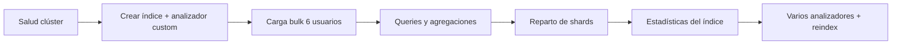

# Lab OpenSearch — Índice `usuarios`

Laboratorio práctico sobre OpenSearch 3.6.0: salud del clúster, creación de un índice con
**mappings custom** y un **analizador de texto personalizado** en español, carga de datos
de ejemplo, queries, reparto de shards y estadísticas.

> **Cómo ejecutarlo:** todos los comandos están en sintaxis **Dev Tools**
> (OpenSearch Dashboards → menú **☰ → Dev Tools → Console**).
> Pega cada bloque y pulsa ▶ (o `Ctrl/Cmd + Enter`) sobre la línea del comando.

> En Dev Tools no hace falta host, credenciales ni `-H Content-Type`: la consola los añade sola.

---

## 1. Salud básica del clúster

### 1.1 Información del nodo / versión

```
GET /
```

### 1.2 Salud global del clúster

```
GET _cluster/health
```

Campos clave:

| Campo | Significado |
|---|---|
| `status` | `green` (todo ok), `yellow` (réplicas sin asignar), `red` (faltan primarios) |
| `number_of_nodes` | nodos en el clúster |
| `active_shards` | shards activos (primarios + réplicas) |
| `unassigned_shards` | shards sin asignar |

### 1.3 Vistas rápidas con `_cat`

```
GET _cat/health?v
```

```
GET _cat/nodes?v
```

```
GET _cat/indices?v
```

---

## 2. Creación del índice con mappings y analizador custom

Creamos el índice `usuarios` con:

- **3 shards primarios** y **1 réplica** (→ 6 shards en total).
- Un **analizador custom `analizador_es`** que aplica:
  - `lowercase` → todo a minúsculas.
  - `asciifolding` → elimina acentos (María → maria), ideal para español.
  - `stop_es` → elimina stopwords en español (`de`, `con`, `la`...).

```
PUT usuarios
{
  "settings": {
    "number_of_shards": 3,
    "number_of_replicas": 1,
    "analysis": {
      "analyzer": {
        "analizador_es": {
          "type": "custom",
          "tokenizer": "standard",
          "filter": ["lowercase", "asciifolding", "stop_es"]
        }
      },
      "filter": {
        "stop_es": { "type": "stop", "stopwords": "_spanish_" }
      }
    }
  },
  "mappings": {
    "properties": {
      "nombre":         { "type": "text", "analyzer": "analizador_es", "fields": { "raw": { "type": "keyword" } } },
      "email":          { "type": "keyword" },
      "edad":           { "type": "integer" },
      "ciudad":         { "type": "keyword" },
      "bio":            { "type": "text", "analyzer": "analizador_es" },
      "intereses":      { "type": "keyword" },
      "activo":         { "type": "boolean" },
      "fecha_registro": { "type": "date", "format": "yyyy-MM-dd" }
    }
  }
}
```

### Notas sobre el mapping

| Campo | Tipo | Por qué |
|---|---|---|
| `nombre` | `text` + sub-campo `nombre.raw` (`keyword`) | `text` para búsqueda full-text; `raw` para ordenar/agregar exacto |
| `email` | `keyword` | valor exacto, no se analiza |
| `edad` | `integer` | permite rangos numéricos |
| `ciudad` | `keyword` | agregaciones y filtros exactos |
| `bio` | `text` (analizada) | búsqueda full-text |
| `intereses` | `keyword` (array) | múltiples valores exactos |
| `activo` | `boolean` | filtro true/false |
| `fecha_registro` | `date` | rangos por fecha |

### Probar el analizador

```
POST usuarios/_analyze
{
  "analyzer": "analizador_es",
  "text": "Científica de DATOS con María"
}
```

**Salida (tokens):** `["cientifica", "datos", "maria"]`
→ se eliminan `de` y `con` (stopwords), se quitan acentos y se pasa a minúsculas.

### Ver el mapping creado

```
GET usuarios/_mapping
```

---

## 2.5 Probar distintos analizadores al indexar campos

El endpoint `_analyze` permite **probar cómo se tokeniza un texto antes de decidir el mapping**.
Es la herramienta clave para elegir la estrategia de indexación de cada campo de tipo `text`.

Hay tres formas de usarlo:

1. **Analizador built-in** (no requiere índice) → `POST _analyze`
2. **Combinación ad-hoc** de `tokenizer` + `filter` (no requiere índice) → `POST _analyze`
3. **Analizador definido en un índice** (como `analizador_es`) → `POST <indice>/_analyze`

### 2.5.1 Comparar analizadores built-in

Mismo texto, distintos analizadores. Cambia el valor de `"analyzer"` y vuelve a ejecutar.

```
POST _analyze
{
  "analyzer": "standard",
  "text": "Niños, los Pingüinos de El Ñandú corrían 100 metros en Madrid-Río"
}
```

Prueba con: `standard` · `simple` · `whitespace` · `keyword` · `spanish` · `stop` · `english`.

**Salidas reales (comparativa):**

| Analizador | Tokens | Qué hace |
|---|---|---|
| `standard` | `niños, los, pingüinos, de, el, ñandú, corrían, 100, metros, en, madrid, río` | minúsculas + separa por símbolos; mantiene acentos y números |
| `simple` | `niños, los, pingüinos, de, el, ñandú, corrían, metros, en, madrid, río` | igual que standard pero **descarta números** |
| `whitespace` | `Niños,, los, Pingüinos, de, El, Ñandú, corrían, 100, metros, en, Madrid-Río` | solo parte por espacios; **conserva mayúsculas, comas y guiones** |
| `keyword` | `Niños, los Pingüinos de El Ñandú corrían 100 metros en Madrid-Río` | **no analiza**: un único token con todo el texto |
| `spanish` | `niñ, pinguin, ñandu, corrian, 100, metr, madrid, río` | minúsculas + stopwords ES + **stemming** (extrae raíz) |

> Observa: `spanish` reduce `metros→metr`, `pingüinos→pinguin` (stemming agresivo), ideal para
> búsquedas por significado; `standard` es más conservador y conserva la palabra completa.

### 2.5.2 Combinación ad-hoc (tokenizer + filtros, sin crear índice)

Útil para **diseñar** un analizador antes de meterlo en el mapping:

```
POST _analyze
{
  "tokenizer": "standard",
  "filter": ["lowercase", "asciifolding"],
  "text": "Niños corrían en Madrid"
}
```
**Salida:** `["ninos", "corrian", "en", "madrid"]` → `asciifolding` quita acentos pero **no** elimina stopwords (`en` permanece).

### 2.5.3 Filtro `edge_ngram` (autocompletar / búsqueda parcial)

```
POST _analyze
{
  "tokenizer": "standard",
  "filter": [
    { "type": "edge_ngram", "min_gram": 2, "max_gram": 4 }
  ],
  "text": "Madrid"
}
```
**Salida:** `["Ma", "Mad", "Madr"]` → genera prefijos; perfecto para autocompletado tipo *search-as-you-type*.

### 2.5.4 Probar el analizador custom del índice

```
POST usuarios/_analyze
{
  "analyzer": "analizador_es",
  "text": "Científica de DATOS con María"
}
```
**Salida:** `["cientifica", "datos", "maria"]` → lowercase + asciifolding + stopwords ES (sin stemming).

### 2.5.5 Analizar un campo concreto del mapping

En vez del nombre del analizador, puedes indicar el **campo** y usa automáticamente su analizador configurado:

```
POST usuarios/_analyze
{
  "field": "bio",
  "text": "Científica de DATOS con María"
}
```

### 2.5.6 Ver detalle completo (posiciones, offsets, tipo de token)

Añade `"explain": true` para depurar qué filtro hace cada transformación:

```
POST usuarios/_analyze
{
  "analyzer": "analizador_es",
  "text": "María corrían",
  "explain": true
}
```

> **Regla práctica:** prueba siempre con `_analyze` antes de fijar el `analyzer` en el mapping.
> Si te equivocas de analizador, tendrás que **reindexar** todo el índice para corregirlo.

---

## 3. Carga de datos de ejemplo (6 usuarios) con `_bulk`

La API `_bulk` usa formato **NDJSON** (una línea de acción + una línea de documento).
En Dev Tools se escribe directamente así (la consola gestiona el `Content-Type`):

```
POST _bulk
{ "index": { "_index": "usuarios", "_id": "1" } }
{ "nombre": "María García López", "email": "maria.garcia@example.com", "edad": 28, "ciudad": "Madrid", "bio": "Ingeniera de software apasionada por la inteligencia artificial", "intereses": ["IA", "running", "lectura"], "activo": true, "fecha_registro": "2024-01-15" }
{ "index": { "_index": "usuarios", "_id": "2" } }
{ "nombre": "Juan Martínez Ruiz", "email": "juan.martinez@example.com", "edad": 35, "ciudad": "Barcelona", "bio": "Arquitecto de datos especializado en sistemas distribuidos", "intereses": ["datos", "ciclismo", "fotografía"], "activo": true, "fecha_registro": "2023-06-22" }
{ "index": { "_index": "usuarios", "_id": "3" } }
{ "nombre": "Ana Fernández Soto", "email": "ana.fernandez@example.com", "edad": 42, "ciudad": "Valencia", "bio": "Científica de datos con experiencia en machine learning", "intereses": ["ML", "yoga", "viajes"], "activo": false, "fecha_registro": "2022-11-03" }
{ "index": { "_index": "usuarios", "_id": "4" } }
{ "nombre": "Carlos Sánchez Díaz", "email": "carlos.sanchez@example.com", "edad": 31, "ciudad": "Madrid", "bio": "Desarrollador backend experto en bases de datos y búsqueda", "intereses": ["backend", "gaming", "música"], "activo": true, "fecha_registro": "2024-03-10" }
{ "index": { "_index": "usuarios", "_id": "5" } }
{ "nombre": "Lucía Rodríguez Gil", "email": "lucia.rodriguez@example.com", "edad": 26, "ciudad": "Sevilla", "bio": "Analista de seguridad informática y entusiasta del open source", "intereses": ["seguridad", "linux", "escalada"], "activo": true, "fecha_registro": "2023-09-18" }
{ "index": { "_index": "usuarios", "_id": "6" } }
{ "nombre": "Pedro Gómez Moreno", "email": "pedro.gomez@example.com", "edad": 39, "ciudad": "Bilbao", "bio": "DevOps engineer trabajando con Kubernetes y observabilidad", "intereses": ["devops", "kubernetes", "senderismo"], "activo": false, "fecha_registro": "2022-05-30" }

```

> ⚠️ En Dev Tools, la **última línea del bulk debe terminar con un salto de línea** (deja una línea en blanco al final).

Refrescar para que sean visibles inmediatamente:

```
POST usuarios/_refresh
```

Verificar el conteo:

```
GET usuarios/_count
```
→ `"count": 6`

---

## 4. Queries

### 4.1 Traer todos los documentos

```
GET usuarios/_search
{
  "query": { "match_all": {} }
}
```

### 4.2 Full-text sobre `bio` (usa el analizador custom)

```
GET usuarios/_search
{
  "query": { "match": { "bio": "datos" } }
}
```
→ Encuentra a Juan, Ana y Carlos (todos mencionan "datos").

### 4.3 Filtro exacto por `keyword`

```
GET usuarios/_search
{
  "query": { "term": { "ciudad": "Madrid" } }
}
```

### 4.4 Rango numérico (edad)

```
GET usuarios/_search
{
  "query": { "range": { "edad": { "gte": 30, "lte": 40 } } }
}
```

### 4.5 Query booleana combinada

```
GET usuarios/_search
{
  "query": {
    "bool": {
      "must":   [ { "match": { "bio": "seguridad" } } ],
      "filter": [ { "term": { "activo": true } } ],
      "should": [ { "term": { "ciudad": "Sevilla" } } ]
    }
  }
}
```

### 4.6 Búsqueda + orden + paginación

```
GET usuarios/_search
{
  "from": 0,
  "size": 3,
  "sort": [ { "edad": "desc" } ],
  "_source": ["nombre", "edad", "ciudad"],
  "query": { "match_all": {} }
}
```

### 4.7 Agregación: usuarios por ciudad

```
GET usuarios/_search
{
  "size": 0,
  "aggs": { "por_ciudad": { "terms": { "field": "ciudad" } } }
}
```

**Salida (buckets):**

| ciudad | doc_count |
|---|---|
| Madrid | 2 |
| Barcelona | 1 |
| Bilbao | 1 |
| Sevilla | 1 |
| Valencia | 1 |

---

## 5. Reparto de shards

El índice se creó con **3 shards primarios + 1 réplica = 6 shards**, repartidos por los 3 nodos.

```
GET _cat/shards/usuarios?v&h=index,shard,prirep,state,docs,node
```

**Salida real:**

```
index    shard prirep state   docs node
usuarios 0     p      STARTED    1 opensearch-nodes-2
usuarios 0     r      STARTED    1 opensearch-nodes-0
usuarios 1     r      STARTED    3 opensearch-nodes-1
usuarios 1     p      STARTED    3 opensearch-nodes-0
usuarios 2     p      STARTED    2 opensearch-nodes-1
usuarios 2     r      STARTED    2 opensearch-nodes-2
```

Observaciones:

- `prirep`: `p` = primario, `r` = réplica.
- Cada primario y su réplica están en **nodos distintos** (alta disponibilidad).
- Los 6 docs se reparten por hash del `_id`: shard0=1, shard1=3, shard2=2.

Salud específica del índice:

```
GET _cluster/health/usuarios
```
→ `status: green` · `active_shards: 6` · `unassigned_shards: 0`

---

## 6. Estadísticas del índice

### 6.1 Stats completas

```
GET usuarios/_stats
```

Secciones útiles dentro de `_all.primaries`:

| Métrica | Path | Significado |
|---|---|---|
| Nº documentos | `docs.count` | documentos indexados |
| Tamaño en disco | `store.size_in_bytes` | bytes ocupados (primarios) |
| Operaciones de indexado | `indexing.index_total` | total de docs indexados |
| Búsquedas | `search.query_total` | nº de queries ejecutadas |

### 6.2 Resumen rápido con `_cat`

```
GET _cat/indices/usuarios?v
```

Muestra `health`, `status`, `docs.count`, `store.size`, etc. en una sola línea.

---

## 7. Varios analizadores por índice + reindexado (comparar stemming)

Caso real: queremos que **`bio`** encuentre variantes de una palabra (`distribuido` ≈ `distribuidos`)
usando **stemming**, pero que **`nombre`** se mantenga literal (sin stemming, para no destrozar nombres propios).

La solución es definir **dos analizadores en el mismo índice** y asignar uno a cada campo.

### 7.1 Crear `usuarios_v2` con dos analizadores

```
PUT usuarios_v2
{
  "settings": {
    "number_of_shards": 3,
    "number_of_replicas": 1,
    "analysis": {
      "filter": {
        "stop_es":    { "type": "stop", "stopwords": "_spanish_" },
        "stemmer_es": { "type": "stemmer", "language": "spanish" }
      },
      "analyzer": {
        "es_nostem": {
          "type": "custom",
          "tokenizer": "standard",
          "filter": ["lowercase", "asciifolding", "stop_es"]
        },
        "es_stem": {
          "type": "custom",
          "tokenizer": "standard",
          "filter": ["lowercase", "asciifolding", "stop_es", "stemmer_es"]
        }
      }
    }
  },
  "mappings": {
    "properties": {
      "nombre":         { "type": "text", "analyzer": "es_nostem", "fields": { "raw": { "type": "keyword" } } },
      "email":          { "type": "keyword" },
      "edad":           { "type": "integer" },
      "ciudad":         { "type": "keyword" },
      "bio":            { "type": "text", "analyzer": "es_stem" },
      "intereses":      { "type": "keyword" },
      "activo":         { "type": "boolean" },
      "fecha_registro": { "type": "date", "format": "yyyy-MM-dd" }
    }
  }
}
```

> `bio` → analizador `es_stem` (con stemming) · `nombre` → analizador `es_nostem` (sin stemming).

### 7.2 Reindexar datos desde `usuarios`

No hace falta volver a cargar el bulk: copiamos los documentos con la API `_reindex`.
Al entrar en el nuevo índice se reanalizan con los nuevos analizadores.

```
POST _reindex?refresh=true
{
  "source": { "index": "usuarios" },
  "dest":   { "index": "usuarios_v2" }
}
```
→ `"created": 6`

### 7.3 Comprobar cómo tokeniza cada analizador

```
POST usuarios_v2/_analyze
{
  "analyzer": "es_stem",
  "text": "distribuidos distribuido"
}
```
→ `["distribu", "distribu"]`

```
POST usuarios_v2/_analyze
{
  "analyzer": "es_nostem",
  "text": "distribuidos distribuido"
}
```
→ `["distribuidos", "distribuido"]`

| Analizador | `"distribuidos distribuido"` |
|---|---|
| `es_stem` (con stemming) | `["distribu", "distribu"]` → **ambas a la misma raíz** |
| `es_nostem` (sin stemming) | `["distribuidos", "distribuido"]` → **tokens distintos** |

### 7.4 La diferencia en las búsquedas

El documento de Juan dice *"...sistemas **distribuidos**"*. Buscamos el singular `distribuido`:

```
GET usuarios/_search
{
  "_source": ["nombre"],
  "query": { "match": { "bio": "distribuido" } }
}
```
→ `total: 0` (NO encuentra: `distribuido` ≠ `distribuidos`)

```
GET usuarios_v2/_search
{
  "_source": ["nombre"],
  "query": { "match": { "bio": "distribuido" } }
}
```
→ `total: 1` → `["Juan Martínez Ruiz"]` (SÍ lo encuentra)

**Resultado:**

| Búsqueda `bio: "distribuido"` | Índice `usuarios` (sin stemming) | Índice `usuarios_v2` (con stemming) |
|---|---|---|
| Documentos encontrados | **0** | **1** (Juan) |

> **Conclusión:** el stemming mejora el *recall* (encuentra variantes morfológicas: singular/plural,
> género, conjugaciones), pero puede generar falsos positivos. En `nombre` lo evitamos a propósito.
> **Importante:** cambiar el analizador de un campo obliga a **reindexar** — no basta con editar el mapping,
> porque los tokens ya guardados en disco se generaron con el analizador anterior.

---

## 8. Limpieza (opcional)

```
DELETE usuarios
```

```
DELETE usuarios_v2
```

---

## Resumen del flujo


